# formation-deep-learning
Les bases du Deep Learning en Intelligence Artificielle.

## Théorie de Hebb

## Le Perceptron (1957)

## Perceptron Multi-Couche

## Forward Propagation

   Consiste à faire circuler les données de la **première couche** jusqu'à la **dernière couche** pour afin produire une sortie **y**.

   
## Cost Function

Elle permet de calculer la moyenne des erreurs de notre modèle.

## Backward Propagation

   Qui consiste à determiner comment la **sortie du réseau** varie
   en fonction des **paramètres (w, b)** présents dans **chaque couche**. Pour cela on calcule une chaine de gradient à savoir comment la sortie de la dernière couche varie en fonction de l'avant dernière, puis comment la sortie de l'avant dernière varie en fonction de l'avant avant dernière ainsi de suite jusqu'à la dernière couche.

   

## Gradient Descent

   Grâce aux gradients, on peut alors mettre à jour les **paramètres (w, b)** de **chaque couche** de telle sorte à ce qu'ils **minimisent** l'erreur entre **la sortie** du modèle et la **réponse attendue**.

   

   ## Résumé 
   Pour développer et entrainer un **Réseau de Neurones Artificiels**, on répète en boucle les quatre étapes suivantes:

   

   ## Le Perceptron

   
   
   ## Modèle Linéaire

   

   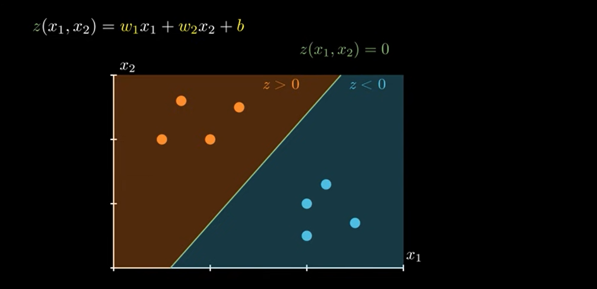

   

   La fonction de faire cette transformation en probabilité est appélée **Sigmoïd**

   

   Exemple 1:

      

   Exemple 2:

      

   ## La Loi de Bernoulli

   

   

   ## Résumé d'un Neurone

   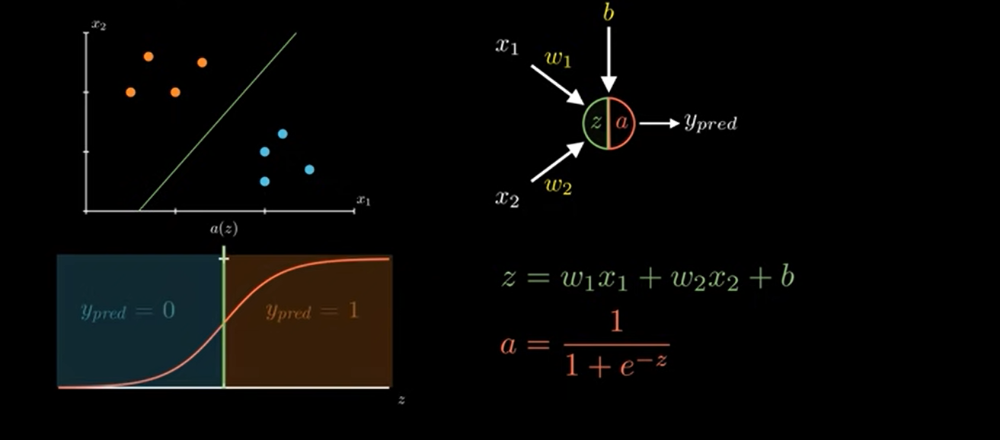

   ## La Fonction Coût

   

   ## Démonstration de la Fonction Coût

   ### Vraisemblance

   

   Exemple: Si une plante est toxique et que notre modèle nous donne une probabilité de 0.8

   

   Alors pour calculer la vraisemblance de notre modèle nous allons nous servir  de la loi de **Bernoulli**

   

   * Si le résultat de notre modèle est proche de 100% ce qui signifie que notre modèle à une vraisemblable proche de 100%

   

   * Sinon si le résultat de notre modèle est proche de 0% ce qui signifie que notre modèle à une vraisemblable proche de 0%

   

   ### Problème de la Vraisemblance 
   
   Comme les probabilités sont des nombres inférieure à 0, alors plus on fait le produit des nombres inférieur à 0 plus on tend vers 0.

   

   

   Pour eviter que la vraisemblance de notre modèle ne converse vers 0, on l'applique le logarithme.

   

   Comme La fonction logarithme est une fonction monotône croissante alors elle conserve l'ordre de nos termes.

   

   Cela signifie que lorsqu'on cherche le maximum de nos  vraisemblances, il sufit de chercher le maximum du log de la vraisemblance. voir graphique
   
   
   
   Alors par deduction on aura:

   

  Pour la formule de log loss:
  Au fait on veut maximiser la vraisemblance or en mathématique il n'existe pas de fonction de maximisation mais il n'existe que des fonctions de minimisation par conséquent on essaie de prendre l'inverse de la fonction de minisation. C'est à dire qu'on multiplie par (-1) puis on normalise par (1/m).

  

  

  ## Origine de Log Loss
  La fonction **Log Loss** elle tire son origine de la maximisation de la vraisemblance(**Likelihood**)

## Descent de Gradient

## Gradient de Descent en Mathématique

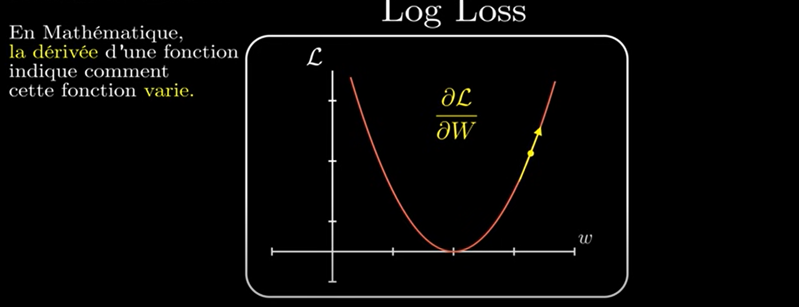

* Si la dérivée est négative ça nous indique que la dérivée diminue lorsque **w** augmente.

* Si la dérivée est positive ça nous indique que la dérivé augmente lorsque **w** augmente.

* **Descente de Gradient**

* en répetant cette formule, le gradient descent jusqu'au minimum de notre fonction.

## Pratique Cours Suivant

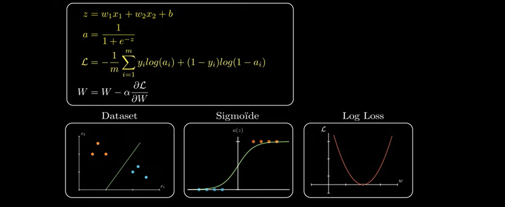

## Quelques dérivées Utiles pour le Cours

## Demonstration de la Descente de Gradient

## Vectorisation

## Exemple en Python

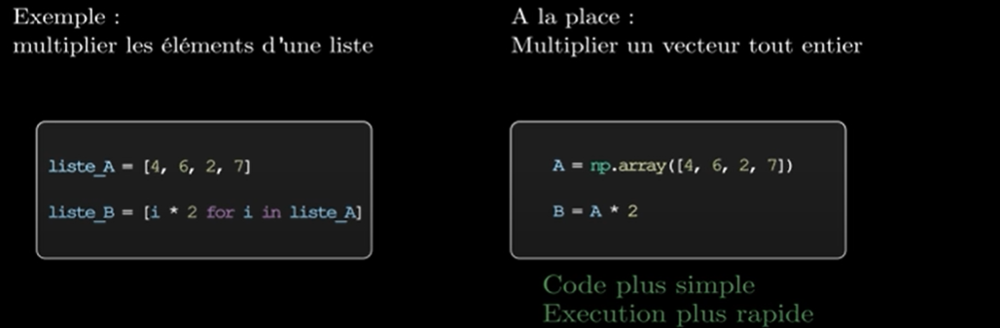

## Utilité des Vecteurs

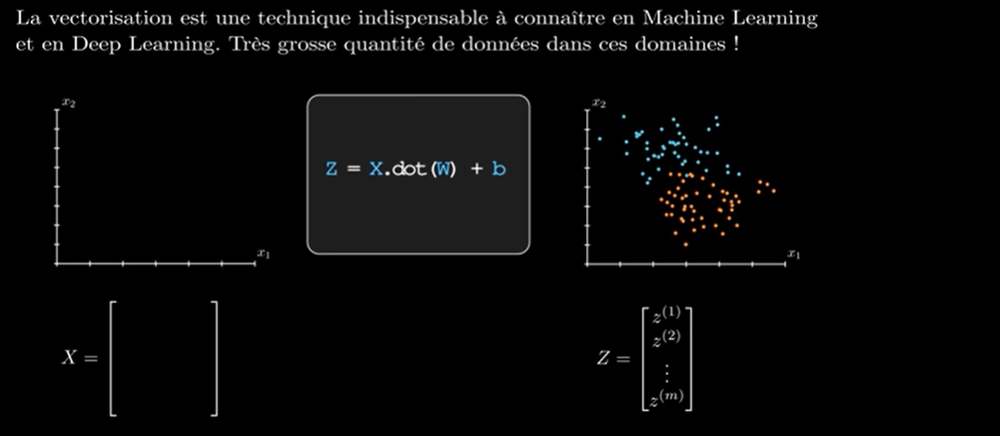

## Matrices

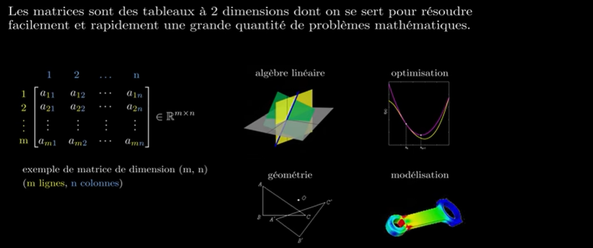

## Exemple 

## Les Opérations Matricielles à Connaître en Deep Learning

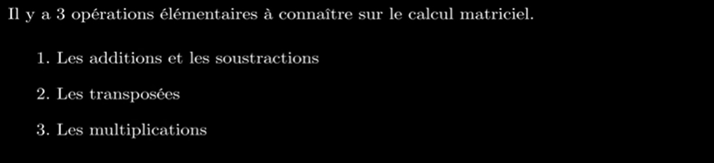

### 1. Les Additions  et Soustractions

### 2. La Transposition

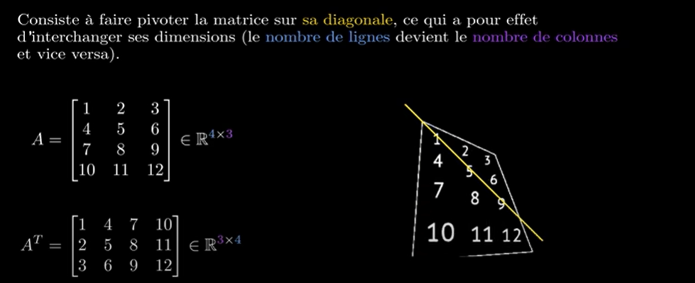

### 3. La Multiplication

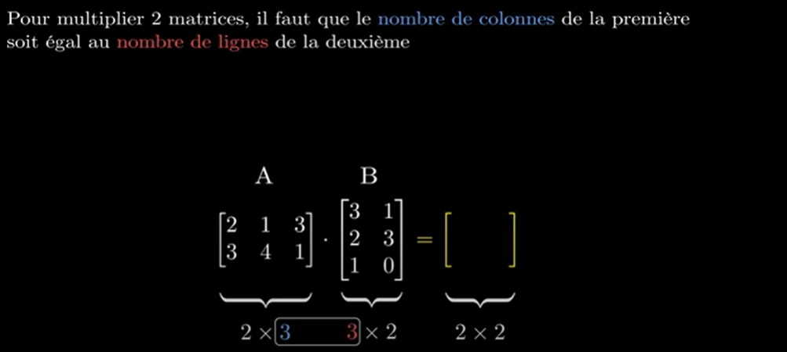

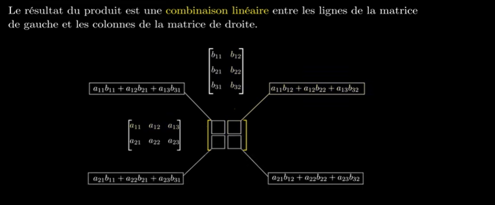

### Exercice

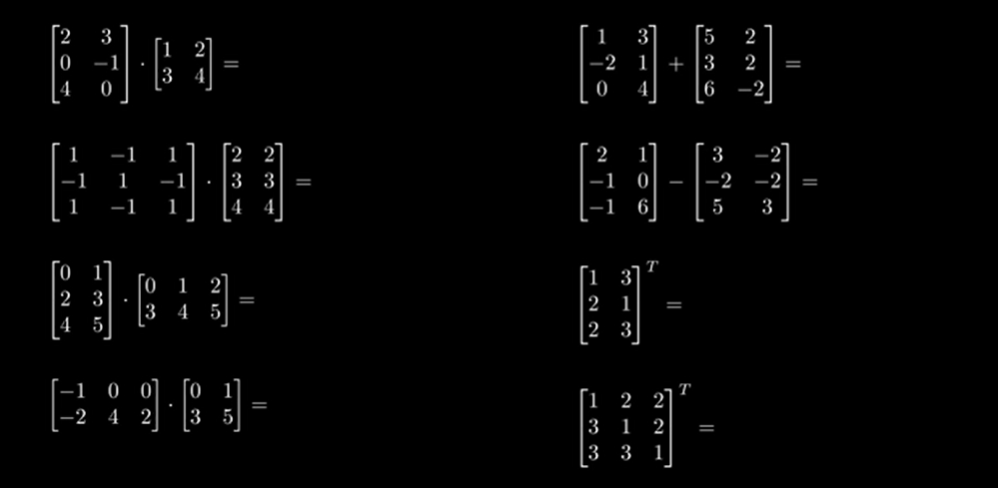

## Vectorisation des Equations de Deep Learning

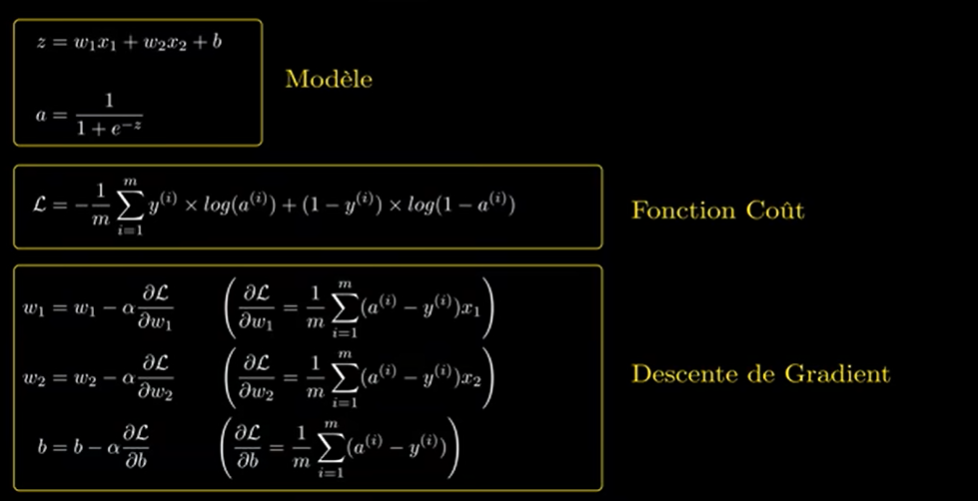

## Dataset 
A la base, on a un Dataset de de x1 et x2 variables indépendantes et y variable dépendante.

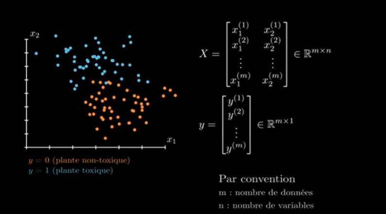

## Vectorisation du Dataset

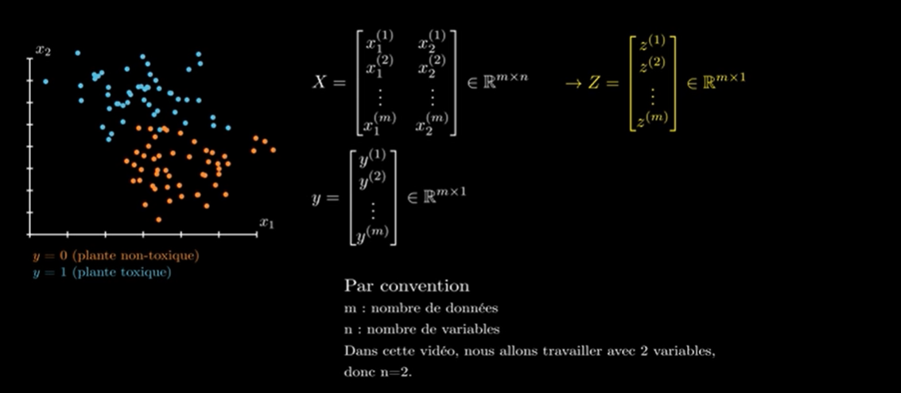

### Vectorisation de Z

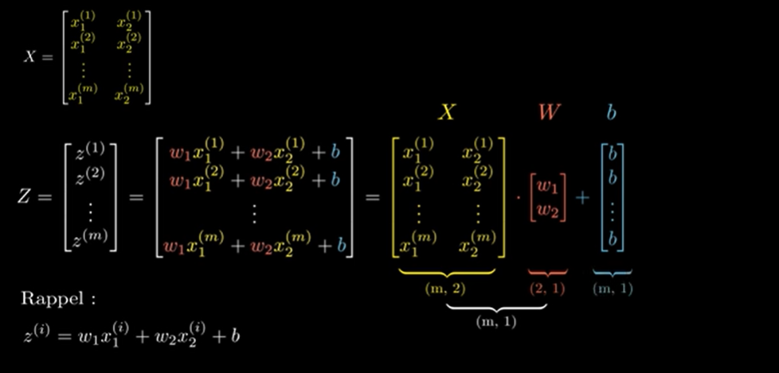

### Vectorisons nos Equations

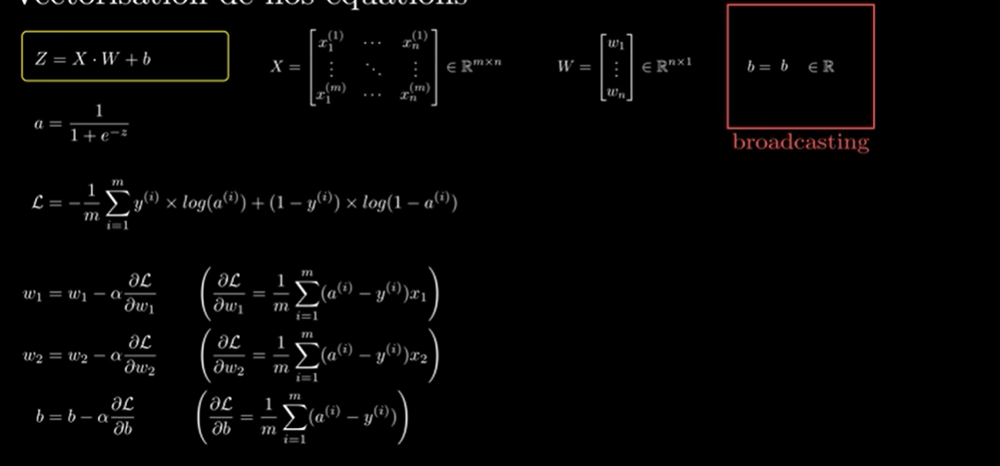

### Vectorisation de A

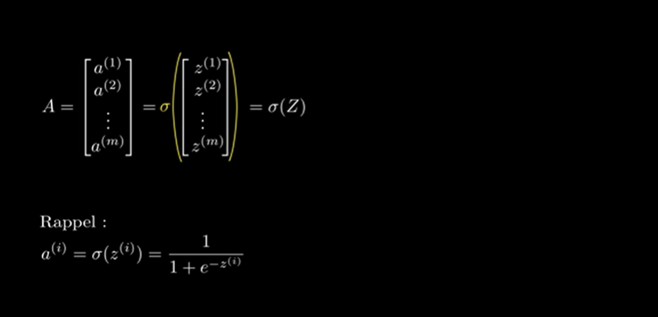

### Vectorisation de la Fonction Coût

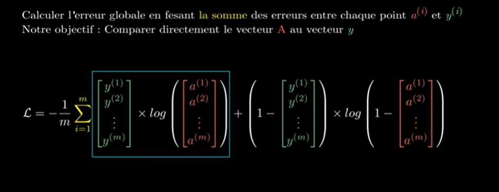

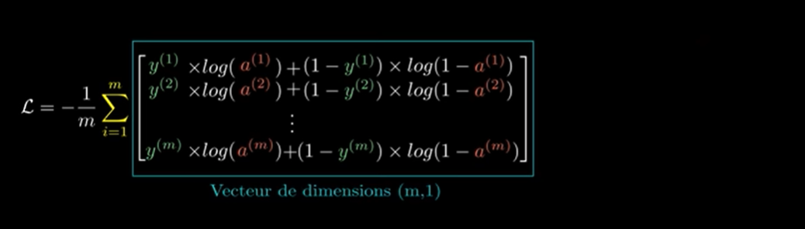

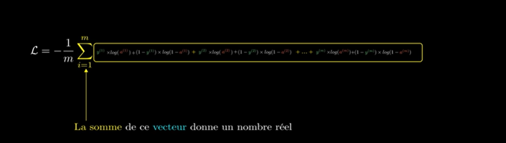

### Vectorisation de la Descente de Gradient

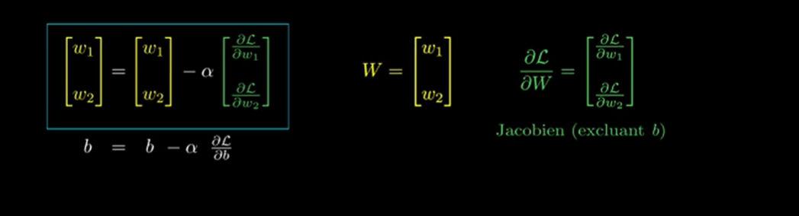

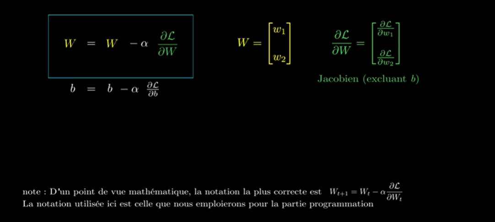

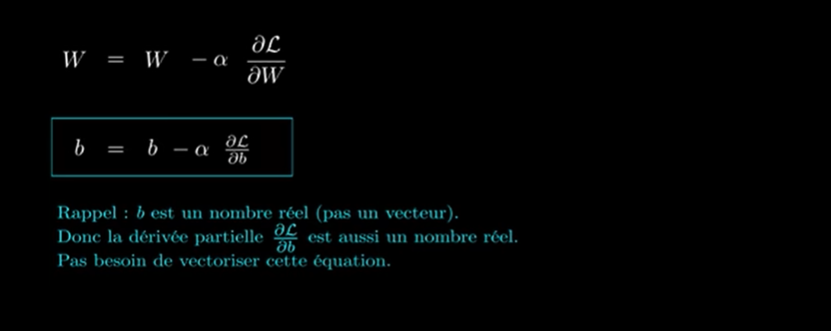

* Au en Python, il nous reste qu'à calculer W et B.

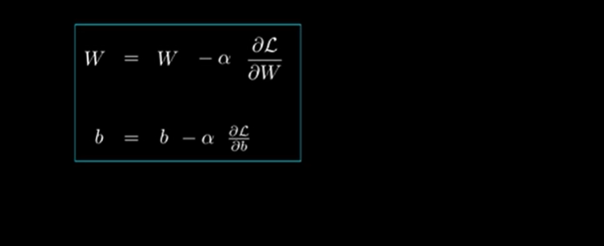

### Vectorisation des Gradients

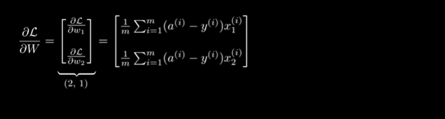

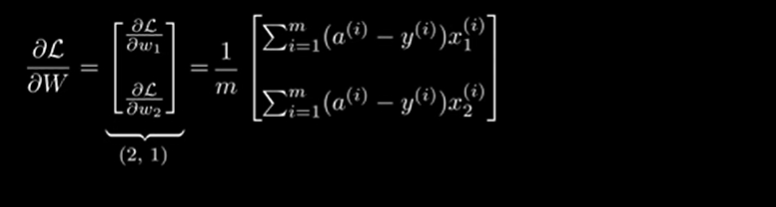

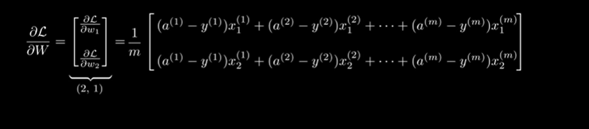